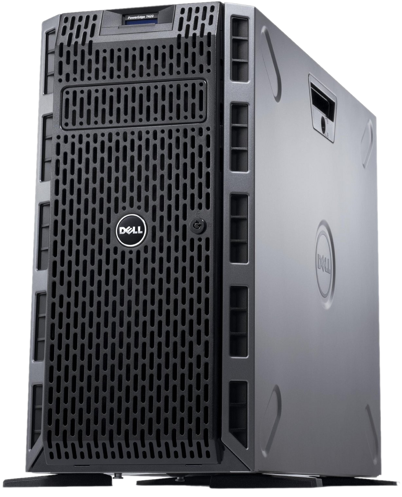

# Prerequisites

If you want to deploy this project for yourself, there are some basic
 requirements that you'll need.

---

## Knowledge

This project is designed to be extremely easy to use, but that does **not**
 mean it is intended for beginners! We're using advanced concepts here, and
 it's expected that you will fork the project and continue development on
 your own.

You should have intermediate knowledge of the following technologies:

- Linux
- Git
- Ceph
- OpenStack or another cloud platform
- GitLab or another CI/CD platform
- Ansible
- Terraform
- Kubernetes
- Packer

---

## Hardware

If you don't already have an OpenStack cloud to deploy on, then you'll need
 some suitable hardware.

<!-- Center the image -->
<!-- markdownlint-disable-next-line MD033 -->
<figure markdown>
  { width=360 }
</figure>

This project is built and tested against an old Dell T420 tower server, which
 can be had for as little as $400. It's a capable and reliable machine, that
 avoids the significant investment of a rack-mounted setup. Perfect for almost
 any homelab!

### Recommended Specs

You can use any hardware you like, however, provided it meets the following
 recommended specs:

|                 | CPU        | Memory     | Storage          | Network      |
|-----------------|------------|------------|------------------|--------------|
| **Minimum**     | 16 threads | 64 GB RAM  | 1x NVMe + 2x HDD | 2x 1 GbE NIC |
| **Recommended** | 24 threads | 128 GB RAM | 1x NVMe + 4x HDD | 2x 1 GbE NIC |

---

## Other Requirements

You'll also need the following:

- A GitLab account
- A Google account (for off-site backups)
- A Cloudflare account and ownership of a second-level domain (like `example.com`)

---

## Initial Setup

### Dependencies

You'll need to install a few dependencies on your local system.

- [Ansible](https://www.ansible.com/)
    - [python-netaddr](https://pypi.org/project/netaddr)
- [Terraform](https://www.terraform.io/)
- [kubectl](https://kubernetes.io/docs/reference/kubectl/)

### Repository

1. Sign in to your GitLab account, and
   [fork](https://gitlab.com/ralgar/homelab/-/forks/new) this project's
   repository.

1. Clone your fork to your local system, and change directory into it.

    ```sh
    git clone https://gitlab.com/<your-namespace>/homelab.git
    cd homelab
    ```

!!!note
    While the main branch is the source of truth for this project, it may
    sometimes be in an undesirable state to work with. Git tags are
    provided to denote stable points in the project's history, and are
    guaranteed to be suitable as a starting point. It is strongly suggested
    that you use the latest tag!
