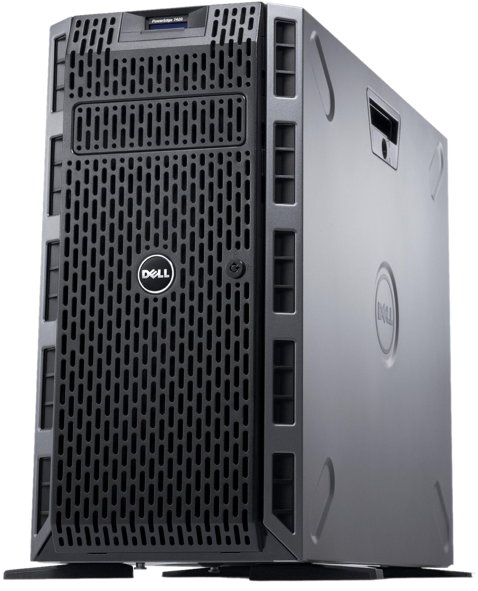

# Prerequisites

If you want to deploy this project for yourself, there are some basic
 requirements that you'll need.

---

## Knowledge

This project is designed to be extremely easy to use, but that does **not**
 mean it is intended for beginners! You should have decent knowledge of the
 following technologies:

- Linux
- Git
- Ceph
- GitLab or another CI/CD platform
- Terraform
- Kubernetes

---

## Server Hardware

If you don't already have a Kubernetes cluster to deploy on, then you'll need
 some suitable hardware.

<!-- Center the image -->
<!-- markdownlint-disable-next-line MD033 -->
<figure markdown>
  { width=360 }
</figure>

This project is deployed on an old Dell T420 tower server, which can be had
 for as little as $400. It's a capable and reliable machine, that avoids the
 significant investment of a rack-mounted setup. Perfect for any homelab!

### Recommended Specs

You can use any hardware you like, however, provided it meets the following
 specs:

|                 | CPU        | Memory     | Storage          | Network      |
|-----------------|------------|------------|------------------|--------------|
| **Minimum**     | 16 threads | 64 GB RAM  | 1x NVMe + 2x HDD | 1x 1 GbE NIC |
| **Recommended** | 24 threads | 128 GB RAM | 1x NVMe + 8x HDD | 2x 1 GbE NIC |

---

## Networking

While it's not a hard requirement, it is recommended to have a decent network
 setup. I will briefly outline the components that I use to build a secure,
 segmented network.

### Hardware

- **Router:** A Mini PC running OPNsense
- **Wireless:** 1x TP-Link Wireless Access Point (WAP)
- **Switches:** 3x TP-Link 8-port managed switches
- **Backbone:** 3x MoCA adapters to leverage my house's coaxial wiring

### VLANs

| **VLAN ID** | **Description** | **CIDR**     | **Hosts**                                     |
|:-----------:|-----------------|--------------|-----------------------------------------------|
| 10          | Trusted         | 10.0.10.0/24 | My desktop and laptop                         |
| 20          | Management      | 10.0.20.0/24 | Network management, iDRAC, Talos API, K8s API |
| 30          | Private         | 10.0.30.0/24 | Private load balancer endpoint                |
| 40          | Public (DMZ)    | 10.0.40.0/24 | Public load balancer endpoint                 |

---

## Other Requirements

You'll also need the following:

- A GitLab account or self-hosted instance
- A Cloudflare account and ownership of a second-level domain (like `example.com`)
- An S3-compatible object storage service of your choice (for backups)

---

## Initial Setup

### Dependencies

You'll need to install a few dependencies on your local system.

- [Terraform](https://www.terraform.io/)
- [kubectl](https://kubernetes.io/docs/reference/kubectl/)
- [Flux CLI](https://fluxcd.io/flux/cmd/)

Also, some optional dependencies to improve your experience.

- [k9s](https://k9scli.io/)
- [Rook Krew Plugin](https://github.com/rook/kubectl-rook-ceph)

### Repository

1. Sign in to your GitLab account, and
   [fork](https://gitlab.com/ralgar/homelab/-/forks/new) this project's
   repository.

1. Clone your fork to your local system, and change directory into it.

    ```sh
    git clone https://gitlab.com/<your-namespace>/homelab.git
    cd homelab
    ```

!!!note
    While the main branch is the source of truth for this project, it may
    sometimes be in an undesirable state to start from. Git tags are
    provided to denote stable points in the project's history, and are
    guaranteed to be suitable as a starting point. It is strongly suggested
    that you use the latest tag!
